# Documentação dos Comandos - Gerador de CLI

Este projeto é um gerador de código que cria uma CLI (Command Line Interface) baseada na estrutura do SDK do MagaluCloud. A CLI gerada utiliza o framework Cobra para gerenciar comandos.

## Visão Geral

O gerador funciona em etapas:
1. **Clonar o SDK** - Baixa o código-fonte do SDK do MagaluCloud
2. **Analisar a Estrutura** - Processa o SDK para entender sua organização (pacotes, serviços, métodos)
3. **Gerar Código CLI** - Cria os arquivos Go necessários para a CLI baseado na estrutura encontrada

---

## Estrutura de Diretórios

```
commands/
├── commands.go              # Registro de todos os comandos disponíveis
├── clone_sdk.go            # Comando para clonar o SDK
├── gen_cli_base.go         # Comando para gerar a base da CLI
├── gen_cli_code/           # Geração de código da CLI
│   ├── code.go             # Função principal de geração
│   ├── gen_root.go         # Gera o root.go
│   ├── gen_package.go      # Gera código de pacotes
│   ├── gen_service.go      # Gera código de serviços
│   ├── gen_product.go      # Gera código de produtos/comandos
│   ├── go_mod.go           # Gera o go.mod
│   └── groups_types.go     # Tipos e templates para geração
└── sdk_structure/          # Análise da estrutura do SDK
    ├── structure.go        # Função principal de análise
    ├── sdk_processor.go    # Processamento do SDK
    ├── menu_processor.go   # Processamento de menus
    ├── service_analyzer.go # Análise de serviços
    └── printer.go          # Impressão da estrutura
```

---

## Arquivos Principais

### `commands.go`
**Responsabilidade:** Registra todos os comandos disponíveis na CLI do gerador.

- `AllCommands()` - Retorna a lista de todos os comandos Cobra disponíveis
- `GenCLICodeCmd()` - Comando `gen-cli-code` para gerar o código completo da CLI
- `GenCLISDKStructureCmd()` - Comando `sdk-structure` para imprimir a estrutura do SDK
- `CloneSDKCmd()` - Comando `clone-sdk` para clonar o SDK (definido em `clone_sdk.go`)
- `GenCLICmd()` - Comando `gen-cli-base` para gerar a base da CLI (definido em `gen_cli_base.go`)

---

### `clone_sdk.go`
**Responsabilidade:** Clona o repositório do SDK do MagaluCloud do GitHub.

**O que faz:**
- Consulta a API do GitHub para obter a última versão (tag) do SDK
- Clona o repositório `github.com/MagaluCloud/mgc-sdk-go` na versão especificada
- Remove diretórios desnecessários (`.git`, `.github`)
- Usa fallback para clonar branch padrão se a tag falhar

**Funções principais:**
- `CloneSDKCmd()` - Define o comando Cobra `clone-sdk`
- `cloneSDK()` - Lógica principal de clonagem
- `getLatestRelease()` - Obtém informações da release via API do GitHub
- `executeGitClone()` - Executa o comando `git clone`
- `cleanupSDKDir()` - Remove arquivos desnecessários do diretório clonado

---

### `gen_cli_base.go`
**Responsabilidade:** Gera a base estrutural da CLI copiando arquivos de template.

**O que faz:**
- Copia os diretórios `base-cli` e `base-cli-gen` para `tmp-cli`
- Prepara o diretório de destino removendo versões anteriores
- Cria a estrutura base necessária para a CLI gerada

**Funções principais:**
- `GenCLICmd()` - Define o comando Cobra `gen-cli-base`
- `genCliBase()` - Lógica principal de cópia
- `copyDirectory()` - Copia recursivamente um diretório
- `copyFile()` - Copia um arquivo individual

---

## Diretório `gen_cli_code/`

### `code.go`
**Responsabilidade:** Função principal que orquestra toda a geração de código da CLI.

**O que faz:**
- Chama `GenCliSDKStructure()` para analisar o SDK
- Limpa o diretório de geração
- Gera o `go.mod`
- Chama as funções de geração em ordem:
  1. `generateRootCode()` - Gera o root.go
  2. `genMainPackageCode()` - Gera código dos pacotes principais
  3. `genPackageCode()` - Gera código de pacotes
  4. `genServiceCode()` - Gera código de serviços
  5. `genProductCode()` - Gera código de produtos/comandos

**Funções principais:**
- `GenCliCode()` - Função principal exportada
- `genMainPackageCode()` - Gera código para pacotes principais (recursivo)
- `genMainPackageCodeRecursive()` - Processa pacotes e subpacotes recursivamente

---

### `gen_root.go`
**Responsabilidade:** Gera o arquivo `root_gen.go` que é o ponto de entrada da CLI gerada.

**O que faz:**
- Cria o arquivo `root_gen.go` no diretório `base-cli-gen/cmd/gen/`
- Adiciona imports necessários (SDK e Cobra)
- Registra todos os pacotes como subcomandos do root
- Cada pacote vira um comando no nível raiz da CLI

**Funções principais:**
- `generateRootCode()` - Gera o arquivo root_gen.go baseado na estrutura do SDK

**Exemplo:** Se o SDK tem pacotes `products` e `settings`, o root.go terá comandos `products` e `settings`.

---

### `gen_package.go`
**Responsabilidade:** Gera código para os pacotes (grupos de comandos) da CLI.

**O que faz:**
- Gera arquivos `.go` para cada pacote do SDK
- Cria comandos de grupo que agrupam serviços relacionados
- Processa pacotes e subpacotes recursivamente
- Gera código apenas para pacotes que têm serviços (ignora pacotes vazios)

**Funções principais:**
- `genPackageCode()` - Inicia a geração de código de pacotes
- `genPackageCodeRecursive()` - Processa pacotes recursivamente

**Exemplo:** Se existe um pacote `products` com serviços `list` e `create`, gera um arquivo `products.go` que agrupa esses comandos.

---

### `gen_service.go`
**Responsabilidade:** Gera código para os serviços (interfaces) da CLI.

**O que faz:**
- Gera arquivos `.go` para cada serviço encontrado no SDK
- Cada serviço vira um grupo de comandos que agrupa métodos
- Processa serviços recursivamente em pacotes e subpacotes

**Funções principais:**
- `genServiceCode()` - Inicia a geração de código de serviços
- `genServiceCodeRecursive()` - Processa serviços recursivamente

**Exemplo:** Se existe um serviço `ProductService` com métodos `List()` e `Create()`, gera um arquivo `productservice.go` que agrupa esses comandos.

---

### `gen_product.go`
**Responsabilidade:** Gera código para os produtos/comandos individuais (métodos dos serviços).

**O que faz:**
- Gera um arquivo `.go` para cada método de cada serviço
- Cada método vira um comando executável na CLI
- Analisa parâmetros e retornos dos métodos para gerar flags e tratamento adequado
- Suporta arquivos customizados (se existirem em `base-cli-custom/`)
- Gera código para tratamento de erros e impressão de resultados

**Funções principais:**
- `genProductCode()` - Inicia a geração de código de produtos
- `genProductCodeRecursive()` - Processa métodos recursivamente
- `setupProductData()` - Configura dados para geração de um produto
- `genProductParameters()` - Gera código para parâmetros do método
- `printResult()` - Gera código para impressão de resultados

**Exemplo:** Se existe um método `ListProducts()` no serviço `ProductService`, gera um arquivo `listproducts.go` que implementa o comando CLI correspondente.

---

### `go_mod.go`
**Responsabilidade:** Gera o arquivo `go.mod` para o projeto CLI gerado.

**O que faz:**
- Lê a versão do SDK do arquivo de configuração
- Gera o `go.mod` usando um template
- Define as dependências necessárias para a CLI gerada

**Funções principais:**
- `genGoModFile()` - Gera o arquivo go.mod

---

### `groups_types.go`
**Responsabilidade:** Define tipos e estruturas de dados usadas na geração de código, além de gerenciar templates.

**O que faz:**
- Define `PackageGroupData` - estrutura que armazena dados para gerar código de grupos
- Define `RootGenData` - estrutura para gerar o root.go
- Gerencia templates embutidos (package_group, service_group, product, etc.)
- Fornece métodos para manipular dados de geração (adicionar imports, comandos, flags, etc.)

**Tipos principais:**
- `PackageGroupData` - Dados para gerar grupos de comandos
- `RootGenData` - Dados para gerar o root
- `SubCommandData` - Dados de um subcomando
- `CommandData` - Dados de um comando

**Funcionalidades:**
- Adicionar imports (evitando duplicatas)
- Adicionar subcomandos e comandos
- Configurar flags do Cobra
- Gerenciar argumentos posicionais
- Escrever arquivos usando templates

---

## Diretório `sdk_structure/`

### `structure.go`
**Responsabilidade:** Função principal que inicia a análise da estrutura do SDK.

**O que faz:**
- Carrega a configuração do projeto
- Processa os menus definidos na configuração
- Retorna uma estrutura `SDKStructure` com todos os pacotes, serviços e métodos encontrados

**Funções principais:**
- `GenCliSDKStructure()` - Função principal exportada que retorna a estrutura completa do SDK

---

### `sdk_processor.go`
**Responsabilidade:** Processa um menu da configuração e gera a estrutura de um pacote do SDK.

**O que faz:**
- Localiza o diretório do SDK correspondente ao menu
- Analisa o package usando `parser.ParseDir` do Go
- Extrai serviços do arquivo `client.go`
- Retorna uma estrutura `Package` com serviços encontrados

**Funções principais:**
- `genCliCodeFromSDK()` - Processa um menu e retorna um Package
- `genCliCodeFromClient()` - Analisa o client.go para extrair serviços

---

### `menu_processor.go`
**Responsabilidade:** Processa menus e submenus da configuração recursivamente.

**O que faz:**
- Processa menus principais e seus submenus
- Cria pacotes de agrupamento para menus que só têm submenus
- Processa menus com SDK Package para extrair serviços
- Mantém a hierarquia de pacotes e subpacotes

**Funções principais:**
- `processMenu()` - Inicia o processamento de um menu
- `processMenuRecursive()` - Processa menus recursivamente mantendo a hierarquia

---

### `service_analyzer.go`
**Responsabilidade:** Analisa serviços e métodos do SDK usando AST (Abstract Syntax Tree) do Go.

**O que faz:**
- Usa `parser.ParseDir` para analisar todo o package de uma vez
- Procura interfaces que correspondem aos serviços
- Extrai métodos das interfaces com seus parâmetros e retornos
- Analisa tipos de parâmetros (primitivos, structs, ponteiros, arrays)
- Mantém cache de packages parseados para melhor performance

**Funções principais:**
- `analyzePackageWithParseDir()` - Analisa um package completo com cache
- `analyzeServiceWithPackage()` - Analisa um serviço específico
- `analyzeFileForServiceWithAST()` - Procura interfaces em arquivos AST
- `genCliCodeFromClient()` - Extrai serviços do client.go

**Detalhes técnicos:**
- Usa cache para evitar re-parsear o mesmo package múltiplas vezes
- Analisa tags JSON para detectar campos opcionais
- Extrai comentários de documentação dos métodos
- Detecta tipos primitivos vs tipos customizados

---

### `printer.go`
**Responsabilidade:** Imprime a estrutura do SDK de forma legível no terminal.

**O que faz:**
- Exibe pacotes, serviços e métodos encontrados
- Mostra parâmetros e retornos de métodos
- Exibe estruturas aninhadas recursivamente
- Formata a saída de forma hierárquica e legível

**Funções principais:**
- `PrintSDKStructure()` - Imprime a estrutura completa do SDK
- `printPackage()` - Imprime um pacote recursivamente
- `printService()` - Imprime um serviço e seus métodos
- `printParameterDetails()` - Imprime detalhes de parâmetros

---

## Fluxo de Execução

### 1. Clonar o SDK
```bash
cligen clone-sdk
```
- Consulta API do GitHub
- Clona o repositório do SDK
- Limpa arquivos desnecessários

### 2. Verificar Estrutura (Opcional)
```bash
cligen sdk-structure
```
- Analisa o SDK clonado
- Imprime estrutura encontrada

### 3. Gerar Base da CLI
```bash
cligen gen-cli-base
```
- Copia templates base
- Prepara estrutura de diretórios

### 4. Gerar Código da CLI
```bash
cligen gen-cli-code
```
- Analisa estrutura do SDK
- Gera todos os arquivos Go necessários:
  - `root_gen.go` - Comando raiz
  - Pacotes (grupos de comandos)
  - Serviços (grupos de métodos)
  - Produtos (comandos individuais)
  - `go.mod` - Dependências

---

## Fluxograma: `make run`

O comando `make run` executa o fluxo completo de geração da CLI. Abaixo está o fluxograma detalhado mostrando todas as funções e códigos executados:

```mermaid
flowchart TD
    Start([make run]) --> Build[make build]
    Build --> GoBuild[go build -o cligen]
    GoBuild --> GenCliCode[./cligen gen-cli-code]
    GenCliCode --> GenCliCodeFunc[GenCliCode]
    
    GenCliCodeFunc --> GenSDKStructure[GenCliSDKStructure]
    GenSDKStructure --> LoadConfig1[config.LoadConfig]
    LoadConfig1 --> ProcessMenus[processMenu para cada menu]
    
    ProcessMenus --> ProcessMenuRec[processMenuRecursive]
    ProcessMenuRec --> CheckMenuType{Menu tem<br/>submenus?}
    
    CheckMenuType -->|Sim| CreateGroupPkg[Criar Package<br/>de agrupamento]
    CheckMenuType -->|Não| CheckSDKPkg{Menu tem<br/>SDKPackage?}
    
    CheckSDKPkg -->|Sim| GenFromSDK[genCliCodeFromSDK]
    CheckSDKPkg -->|Não| SkipMenu[Pular menu vazio]
    
    GenFromSDK --> AnalyzePkg[analyzePackageWithParseDir]
    AnalyzePkg --> ParseDir[parser.ParseDir]
    ParseDir --> GenFromClient[genCliCodeFromClient]
    
    GenFromClient --> FindClientFile[Procurar client.go]
    FindClientFile --> ExtractMethods[Extrair métodos<br/>do cliente]
    ExtractMethods --> AnalyzeService[analyzeServiceWithPackage]
    
    AnalyzeService --> FindInterface[Procurar interface<br/>no AST]
    FindInterface --> AnalyzeMethods[analyzeFileForServiceWithAST]
    AnalyzeMethods --> ExtractParams[Extrair parâmetros<br/>e retornos]
    
    CreateGroupPkg --> AddToStructure[Adicionar ao<br/>SDKStructure]
    ExtractParams --> AddToStructure
    SkipMenu --> AddToStructure
    
    AddToStructure --> CleanDir[cleanDir]
    CleanDir --> GenGoMod[genGoModFile]
    GenGoMod --> LoadConfig2[config.LoadConfig]
    LoadConfig2 --> WriteGoMod[WriteGoModFile]
    
    WriteGoMod --> GenRoot[generateRootCode]
    GenRoot --> NewRootData[NewRootGenData]
    NewRootData --> AddRootImports[AddImport SDK/Cobra]
    AddRootImports --> AddRootSubCmds[AddSubCommand<br/>para cada pacote]
    AddRootSubCmds --> WriteRoot[WriteRootGenToFile]
    
    WriteRoot --> GenMainPkg[genMainPackageCode]
    GenMainPkg --> GenMainPkgRec[genMainPackageCodeRecursive]
    GenMainPkgRec --> NewPkgData[NewPackageGroupData]
    NewPkgData --> SetupPkgData[Configurar dados<br/>do pacote]
    SetupPkgData --> SetupServices[setupMainPackageServices]
    SetupServices --> SetupSubPkgs[setupMainPackageSubPackages]
    SetupSubPkgs --> WritePkgFile[WriteGroupToFile ou<br/>WriteSubPackageToFile]
    
    WritePkgFile --> GenPkg[genPackageCode]
    GenPkg --> GenPkgRec[genPackageCodeRecursive]
    GenPkgRec --> CheckPkgServices{Tem serviços<br/>e sem subpacotes?}
    CheckPkgServices -->|Sim| SetupPkgGroup[Configurar grupo<br/>de pacote]
    CheckPkgServices -->|Não| SkipPkg[Pular pacote]
    SetupPkgGroup --> WritePkgGroup[WriteGroupToFile]
    
    WritePkgGroup --> GenService[genServiceCode]
    GenService --> GenServiceRec[genServiceCodeRecursive]
    GenServiceRec --> ForEachService[Para cada serviço]
    ForEachService --> NewServiceData[NewPackageGroupData]
    NewServiceData --> SetupServiceData[Configurar dados<br/>do serviço]
    SetupServiceData --> AddServiceMethods[AddCommand para<br/>cada método]
    AddServiceMethods --> WriteServiceFile[WriteServiceToFile]
    
    WriteServiceFile --> GenProduct[genProductCode]
    GenProduct --> GenProductRec[genProductCodeRecursive]
    GenProductRec --> ForEachMethod[Para cada método]
    ForEachMethod --> CheckCustomFile{Arquivo<br/>customizado<br/>existe?}
    
    CheckCustomFile -->|Sim| WriteCustom[WriteProductCustomToFile]
    CheckCustomFile -->|Não| SetupProduct[setupProductData]
    
    SetupProduct --> GenParams[genProductParameters]
    GenParams --> AddCobraFlags[Adicionar flags<br/>do Cobra]
    AddCobraFlags --> PrintResult[printResult]
    PrintResult --> WriteProduct[WriteProductToFile]
    
    WriteCustom --> GenCliBase[./cligen gen-cli-base]
    WriteProduct --> GenCliBase
    
    GenCliBase --> GenCliBaseFunc[genCliBase]
    GenCliBaseFunc --> EnsureDest[ensureDestDirReady]
    EnsureDest --> RemoveDest{tmp-cli<br/>existe?}
    RemoveDest -->|Sim| RemoveDir[os.RemoveAll]
    RemoveDest -->|Não| VerifySrc1[verifySourceDir<br/>base-cli]
    
    RemoveDir --> VerifySrc1
    VerifySrc1 --> CopyBaseCli[copyDirectory<br/>base-cli]
    CopyBaseCli --> CopyFiles1[copyFile para<br/>cada arquivo]
    
    CopyFiles1 --> VerifySrc2[verifySourceDir<br/>base-cli-gen]
    VerifySrc2 --> CopyBaseCliGen[copyDirectory<br/>base-cli-gen]
    CopyBaseCliGen --> CopyFiles2[copyFile para<br/>cada arquivo]
    
    CopyFiles2 --> End([Geração concluída])
    
    style Start fill:#e1f5ff
    style End fill:#d4edda
    style GenCliCodeFunc fill:#fff3cd
    style GenSDKStructure fill:#fff3cd
    style GenRoot fill:#fff3cd
    style GenMainPkg fill:#fff3cd
    style GenPkg fill:#fff3cd
    style GenService fill:#fff3cd
    style GenProduct fill:#fff3cd
    style GenCliBaseFunc fill:#fff3cd
```



### Legenda do Fluxograma

**Cores:**
- 🔵 Azul claro: Início/Fim do processo
- 🟡 Amarelo: Funções principais de geração
- 🟢 Verde: Fim bem-sucedido

**Principais Etapas:**

1. **Build** - Compila o binário `cligen`
2. **Análise do SDK** - Processa menus e analisa estrutura do SDK
3. **Geração de Código:**
   - `root_gen.go` - Comando raiz
   - Pacotes principais - Grupos de comandos
   - Pacotes - Grupos de serviços
   - Serviços - Grupos de métodos
   - Produtos - Comandos individuais
   - `go.mod` - Dependências
4. **Geração da Base** - Copia templates e estrutura base

**Funções Recursivas:**
- `processMenuRecursive` - Processa menus hierárquicos
- `genMainPackageCodeRecursive` - Gera código de pacotes aninhados
- `genPackageCodeRecursive` - Gera código de subpacotes
- `genServiceCodeRecursive` - Gera código de serviços recursivamente
- `genProductCodeRecursive` - Gera código de métodos recursivamente

---

## Exemplo de Saída Gerada

Para um SDK com:
- Pacote `products`
  - Serviço `ProductService`
    - Método `List()`
    - Método `Create()`

O gerador cria:
```
base-cli-gen/cmd/gen/
├── root_gen.go                    # Registra 'products' como comando
├── products/
│   ├── products.go                # Grupo de comandos 'products'
│   └── productservice/
│       ├── productservice.go      # Grupo de métodos do serviço
│       ├── list.go                # Comando 'list'
│       └── create.go              # Comando 'create'
└── go.mod                         # Dependências
```

---

## Notas Importantes

- O gerador usa **templates** para gerar código, facilitando customizações
- Arquivos customizados podem ser colocados em `base-cli-custom/` e serão usados no lugar dos gerados
- A estrutura gerada segue a hierarquia do SDK: `Pacote > Serviço > Método`
- Todos os comandos gerados usam o framework **Cobra** para CLI
- O código gerado interage com o SDK do MagaluCloud através do cliente Go

